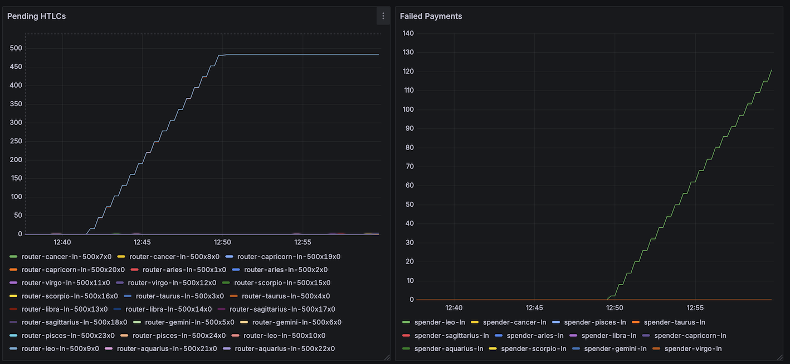
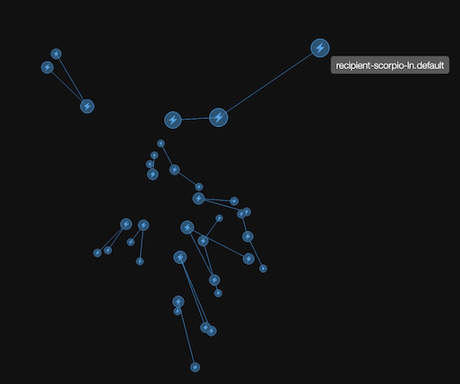
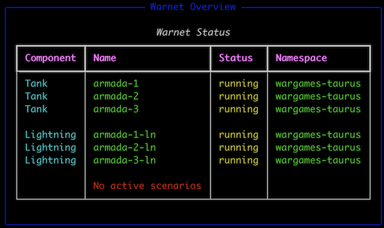

# Warnet: The Wrath Of Nalo
## An online, interactive Bitcoin Lightning Network attack contest.


## ⚡️ Objectives

You will be assigned a team (for example _"aries"_). Your team name identifies
nodes on the network that are designated as your attack targets. When these
nodes suffer, your team's score will increase.

To earn points for your team, complete these attacks against your designated targets.
You may skip ahead to the [Warnet scenarios](#warnet-scenarios) section for a
quick preview on how these attacks will be deployed once you are all set up.

### Channel Jamming

Each team is assigned three nodes that are connected by a chain of Lightning Network channels:

`<spender> --- <router> --- <recipient>`

Every 5 seconds, `<spender>` attempts to send a 600-satoshi
[keysend payment](https://bitcoinops.org/en/topics/spontaneous-payments/)
to `recipient` through the `<router>` node.

Your goal is to stop those payments by jamming those channels with "hold invoices":
- https://bitcoinops.org/en/topics/channel-jamming-attacks/
- https://bitcoinops.org/en/topics/hold-invoices/

### Crash Vulnerable Nodes

Each team will also be assigned a `vuln` node which runs LND version `18.2-beta`.
This version of LND was released in July 2024 and has a known critical vulnerability
which was disclosed in July 2025 by Matt Morehouse:
- https://morehouse.github.io/lightning/lnd-gossip-timestamp-filter-dos/

Your goal is to execute this attack by sending custom p2p messages to the target
node until it OOM-crashes.


## ⚡️ Environment

The simulated network is run in a kubernetes cluster using
[Warnet](https://github.com/bitcoin-dev-project/warnet).
You will have to install and set up Warnet on your local device to interact
with the cluster. You will also have the option to run your own miniature
simulation locally if you want to poke around or test out your attacks before
deploying them to the battlefield.

### Signet

The battlefield runs on a Signet network, meaning only the game administrator
can generate blocks. A new block is added to the chain every 60 seconds. Keep
in mind channel open transactions require a few confirmations before payments
can be sent!

You are in complete control of a small group of Bitcoin Core and LND nodes called
your "armada". Your armada Lightning Network nodes will be funded with signet BTC
before the game starts, so you can begin opening channels right away. You can run
`lncli` and `bitcoin-cli` commands on these nodes, and ssh into their containers.
See the [attack section](#%EF%B8%8F-attack-) below to learn how to send commands
to your armada nodes.

> [!TIP]
> There are more than a hundred other nodes on the network you do *not* have access to!


### Install and setup Warnet

1. Clone this directory
```
git clone https://github.com/bitcoin-dev-project/wrath-of-nalo
cd wrath-of-nalo
```

2. Create a python virtual environment
```
python -m venv .venv && source .venv/bin/activate
```

3. Install Warnet FROM PIP (NOT GITHUB)
```
pip install warnet
```

> [!WARNING]
> Make sure you installed Warnet correctly -- at least version 1.1.17 is required.
> If you do not see the correct version, reinstall Warnet or ask for help.

```
$ warnet version
warnet version 1.1.17
```

4. Set up Warnet
This command will determine some options and then install Warnet's dependencies
into your local virtual environment. You must allow Warnet setup to install
kubectl and helm or already have them installed on your system.
```
warnet setup
```

> [!WARNING]
> If you plan on testing locally you will need Docker Desktop (MacOS) or Minikube (Linux).
> If you do NOT want to run a local cluster for testing, you can choose "No Backend"
> and connect directly to the remote cluster to enter the game, WITHOUT installing
> or running Docker Desktop or Minikube.

## ⚡️ Enter the game

The administrator will give everyone on your team a `kubeconfig` file which will
give your Warnet client access to small set of Bitcoin and Lightning Network nodes.
You have full control over these nodes, they are your armada.
```
warnet auth /path/to/warnet-user-wargames-kubeconfig
```

> [!WARNING]
> Do not execute `warnet auth` if you plan to test locally.
> Read through the [local testing section](#%EF%B8%8F-local-testing) first.

If you are also running the local test environment you can switch back to your
original kubernetes context with the command:
```
warnet auth --revert
```

## ⚡️ Explore the network

You can open the network dashboard in a web browser:
```
warnet dashboard
```

You'll notice links to two services there:

### Grafana

From the Grafana landing page, select `Dashboards` and then `Wrath of Nalo Dashboard`.

This will serve as our contest scoreboard. A team has succefully jammed their
target when the `router` pending HTLCs hits its protocol limit and the corresponding
`spender` indicates failed payments.



### LnVisualizer

This is your Lightning Network explorer. Use it to evaluate network topology
and find nodes to attack. It will be essential for you to determine the
[public identity key](https://github.com/lnbook/lnbook/blob/develop/14_encrypted_transport.asciidoc#the-channel-graph-as-decentralized-public-key-infrastructure)
of the Lightning Network nodes you want to connect to.

The alias presented in the visualizer can also be used as a hostname
for Lightning Network p2p connections. Notice the suffix `.default` which
is a domain name applied by kubernetes and must be used when connecting
(see [Warnet CLI](#warnet-command-line-interface) below).

The data feed for this visualizer updates every 60 seconds. You may need
to frequently refresh it by clicking the top-right gear icon,
clicking `Delete Local Graph Database`, and then reloading the webpage.



### K9s (optional installation)

https://k9scli.io/

This is a very handy text-based terminal interface for managing kubernetes clusters.
It's optional but you might enjoy how easy it is to SSH into your nodes or diagnose issues.

## ⚡️ ATTACK !!!

You will use Warnet to coordinate your attacks and interact with your armada.
You can run individual commands from your terminal or write a
[scenario](https://github.com/bitcoin-dev-project/warnet/blob/main/docs/scenarios.md)
which is a python script that can be deployed into the cluster and execute long series
of commands to multiple nodes.

### Warnet command line interface

To start, try `warnet status`. This will display the Bitcoin full nodes ("Tanks")
and Lightning Network nodes you have access to:



You can execute all
[`lncli` commands](https://lightning.engineering/api-docs/api/lnd/)
through the Warnet interface by replacing `lncli` with `warnet ln rpc <node name>`.

For p2p connections, including `openchannel` with the `--connect` option, be sure
to include the complete hostname of the node you want to connect to, including
the `.default` suffix, e.g. `aries-spender-ln.default`.

<details>
<summary>Expand this section to see some examples</summary>

```
(.venv) $ warnet ln rpc armada-1-ln walletbalance
{
    "total_balance":  "10000000000",
    "confirmed_balance":  "10000000000",
    "unconfirmed_balance":  "0",
    "locked_balance":  "0",
    "reserved_balance_anchor_chan":  "0",
    "account_balance":  {
        "default":  {
            "confirmed_balance":  "10000000000",
            "unconfirmed_balance":  "0"
        }
    }
}
```

```
(.venv) $ warnet ln rpc armada-1-ln openchannel \
  0328ed8ed73d267c117fa7406eb093458fce613a06aec9dc18df1a313d12895e5a \
  --connect tank-0000-ln.default --local_amt=10000000
{
    "funding_txid": "1840a6d8a003f89abf1a633fee32bae8b96cf1707df174f852a4ee98f2f36718"
}
```

```
(.venv) $ warnet ln rpc armada-1-ln pendingchannels
{
    "total_limbo_balance":  "0",
    "pending_open_channels":  [
        {
            "channel":  {
                "remote_node_pub":  "039e483a49be48fde184e0fca39d53c7a12639212e25dc16c6e7149687b5e636e2",
                "channel_point":  "39dd8f08511c3955143b3b90f6cbd72779566c1d093b59443de661b06e0e273b:0",
                "capacity":  "12345678",
                "local_balance":  "12342208",
                "remote_balance":  "0",
                "local_chan_reserve_sat":  "123456",
                "remote_chan_reserve_sat":  "123456",
                "initiator":  "INITIATOR_LOCAL",
                "commitment_type":  "ANCHORS",
                "num_forwarding_packages":  "0",
                "chan_status_flags":  "",
                "private":  false,
                "memo":  "",
                "custom_channel_data":  ""
            },
            "commit_fee":  "2810",
            "commit_weight":  "772",
            "fee_per_kw":  "2500",
            "funding_expiry_blocks":  2015
        }
    ],
    "pending_closing_channels":  [],
    "pending_force_closing_channels":  [],
    "waiting_close_channels":  []
}
```
</details>

### Warnet scenarios

You can create your own scenario files or modify some of those included in [/scenarios](./scenarios).

Once you have your attacker channels set up correctly you can use a scenario to
start a channel-jamming attempt. Review the **incomplete template scenario**
[`ln_channel_jam.py`](./scenarios/ln_channel_jam.py).
YOU MUST modify it, and then run it from your terminal:

```
warnet run scenarios/ln_channel_jam.py --debug
```

The `--debug` flag will stream the scenario's
log output to your terminal. If you omit that flag the scenario will run entirely
in the cluster until it exits. You can still stream its logs or cancel it using
`warnet stop`.

Similarly, review, modify, and then execute the
[`ln_p2p_message.py`](./scenarios/ln_p2p_message.py) scenario to try a DoS attack.
This scenario accepts as an argument the complete URI (`pubkey@hostname:port`)
of the node to connect to:

(example)
```
warnet run scenarios/ln_p2p_message.py --debug \
  --peer=02e257184ee3a37b9f0cc69aa938a3c06656bf9f803f5647c9a25ebdfc442d6de3@aries-vuln-ln.default:9735
```

## ⚡️ Local testing

If you have Docker Desktop
[with Kubernetes enabled](https://docs.docker.com/desktop/features/kubernetes/)
or Minikube installed locally, you can deploy a single-team network on a regtest
chain, giving you full administrative control and the ability to interact with
the target nodes as well.


Deploy the local test network by running the included script:
```
./scripts/deploy.sh regtest4
```

And then follow all the same directions above. This script will also generate
a new kubeconfig for the single team `aries` for your local network which you can load
with:

```
warnet auth ./kubeconfigs/warnet-user-wargames-aries-kubeconfig
```

To return to the admin position you must reset your kubernetes context with:
```
warnet auth --revert
```

From the admin position you can generate regtest blocks by sending RPC commands
to the mining node (or any other node):

```
warnet bitcoin rpc miner -generate 1
```

Shut down the local network (from the admin position):
```
warnet down
```

> [!WARNING]
> Be careful you are not authorized to your team's actual armada on the battlefield!
> You may inadvertently shut down your own attacker nodes!
